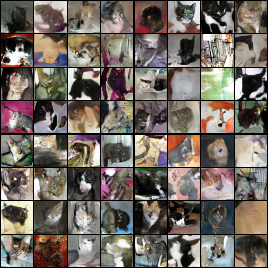

# Wasserstein GAN
## Generative Adversarial Networks
GANs provide a zero-sum game between a generator network and a discriminator network which compete against each other in generating and identifiying artificial samples. Given Gaussian random noise, the generator learns to resemble the distribution of training set and draw random samples from it. A discriminator network is trying to tell artificial samples apart from real samples. Both networks compete during the training cycle and learn from each other. 

The above image shows artificial images of cats trained on the [Dogs vs. Cats](https://www.kaggle.com/c/dogs-vs-cats) dataset on Kaggle. Results are low-resolution (64x64) and low quality as i did not yet had enough training time on my GPU to achieve good results. A hgher resolution, a better network architecture and a systematic hyperparameter optimization would surely yield more satisfying and visually more pleasing results. 

## The training cycle
GANS ary typically trained in an alternating fashion. First, the discriminator is trained on a random selection of true samples and artificial samples with the objective to properly tell them apart. Then, the generator is trained by feeding artifical samples through the discriminator and using gradients from the discriminator to update the generator such that maximizes the loss of the discriminator. This is repeated until both network cannot improve any further.

In the classical [DCGAN](https://arxiv.org/pdf/1511.06434.pdf) formulation, the discriminator uses a sigmoid activiation in the final layer and the network is trained use binary-cross entropy loss. This gives rise to two very prominent problems that Wasserstein GANs try to circumvent. 

## Mode collapse
As the generator tries to maximize the loss of the discriminator, a typical pitfall of this scheme is called *mode collapse*. This is the case when the generator ignores the provided Gaussian noise but converges to produce only a single (or reduced subset of) sample(s) everytime. These are the samples the discriminator cannot tell apart thus they are an optimal solution for the GAN game. When the discriminator learns to identify those samples, the generator alternates to a different mode but fails to learn the diversity of the data distribution. While being in optimal solution in a mathematical sense, mode collapse contradicts the initial purpose of using GANs: Drawing a variety of random samples from the underlying sample distribution. Once collapsed, the network can no longer be used to achieve this task thus failing the purpose.

## Vanishing Gradients
The other well known error case of classical DC-GANs are vanishing gradients. If the discriminator learns too fast or becomes too strong at any point in time, the generator can no longer learn. In that situation, the discriminator pushes all activiations to the far end of the sigmoid function, thus providing very little gradients to learn from. Any small movement of the generator to fool the discriminator is immediately countered by the discriminator adapting. The generator cannot leave its current local mimimum and stops learning. 

## Wasserstein GANs
[Wasserstein GANs](https://arxiv.org/pdf/1701.07875.pdf) were developed to avoid the above problems proving a different loss function. They are called Wasserstein GANs as the authors claim to minimizes the [Wasserstein metric](https://en.wikipedia.org/wiki/Wasserstein_metric) (earth mover distance) between the two distributions, however it has recently [been shown](https://arxiv.org/pdf/2103.01678.pdf) that this is actually not the case and that the Wasserstein distance would not be a good metric to optimize for in the first place. Nonetheless, Wasserstein GANs provide an effective measure to help stabilizing the training procedure of GANs and thus provide more reliable results. The cost of this advantage is the slightly higher training time of these networks as they, in general, require more iterations to converge.

## The Wasserstein loss
WGANs don´t use a sigmoid activiation in the final layer of the discriminator. Their output is thus unbounded and cannot be interpreted as a probability measure. Therefor, the discriminator is ofter called a "critic" rather than an actual discriminator. It "rates" the *realness* of provided samples on the real axis and is trained to assign positive values to real samples and negative values to artificial samples. With $D$ being the discriminator function and $G$ being the generator, the wasserstein loss for the discriminator becomes

$l_d = D(G(z))-D(x)$

where $x$ denote real samples and $z$ denote the Gaussian random noise seeding the generator for sample generation. During training the discriminator, this loss is minimized by adapting the discriminator weights. While training the generator, the loss becomes

$l_g = -D(G(z))$

which is minimized by maximizing $D(G(z))$, thus training the generator to *fool* the discriminator best. 

## Unbounded growth of the loss
In the above formulation the loss can grow unbounded are there is no sigmoid or other bounded activiation function used. In order to minimize the loss $l_d$, the discriminator could thus assign ever growing or shrinking values to real or artificial samples. This would prevent an effective training as the discriminator could start to ignore most samples and focus on assigned super high values to only a small subset of the data, still minimizing its objective while doing so. To prevent this, the discriminator weights need to be constrained from growing indefinitely. Similar to weight decay, where high weights are punished during the training procedure, the authors propose the clip weights within a limited range on the real plane, e.g. clip all weights between $-0.01$ and $0.01$. 
